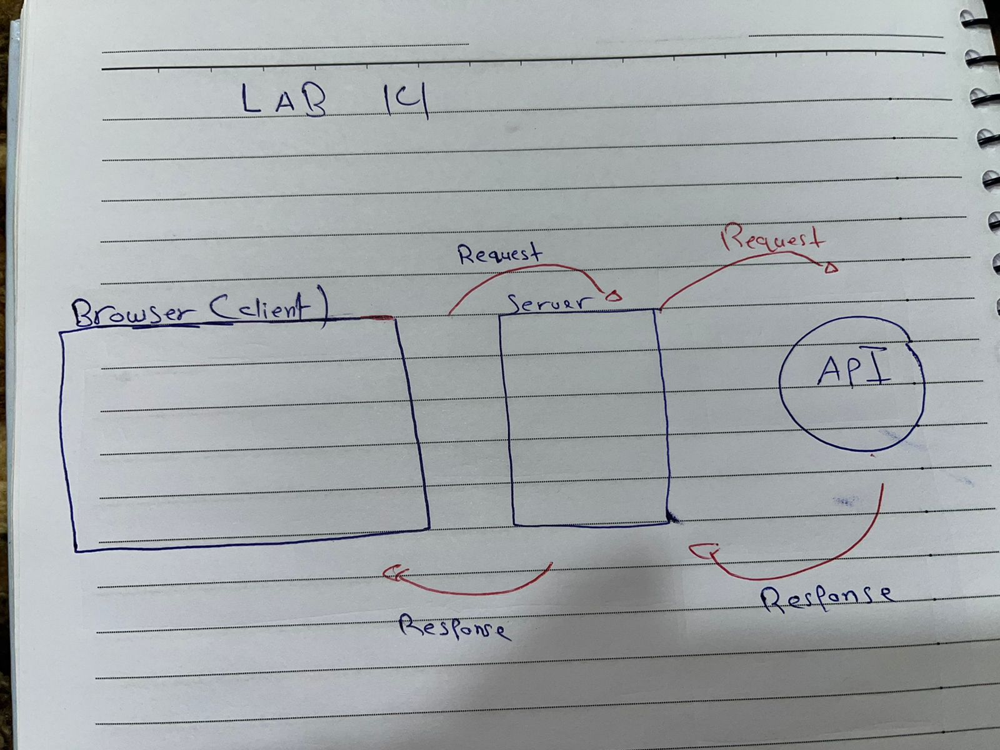
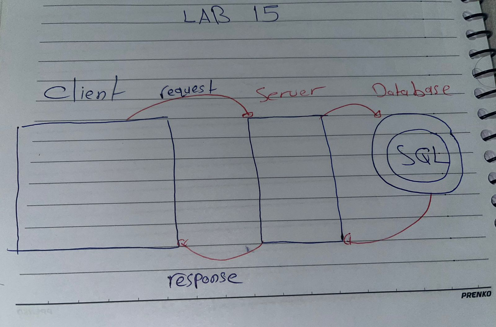

# Movies-Library

Project Name - Project Version

**Author Name**: Bashar Alirani

## WRRC

=======

## Overview

## Getting Started

In this lab you have to edit you enviroment and create a schema.sql file after creating your database.

## Project Features

The user can route to the trending page so he will find the trending movie from the provided API
User can also search for any TV series name or a movie..
Also user can route for people searching page and search for any actor name.

I have created handleAddMovie: inserts a new movie into the PostgreSQL database.
also created handleGetMovies: retrieves all movies from the PostgreSQL database.
