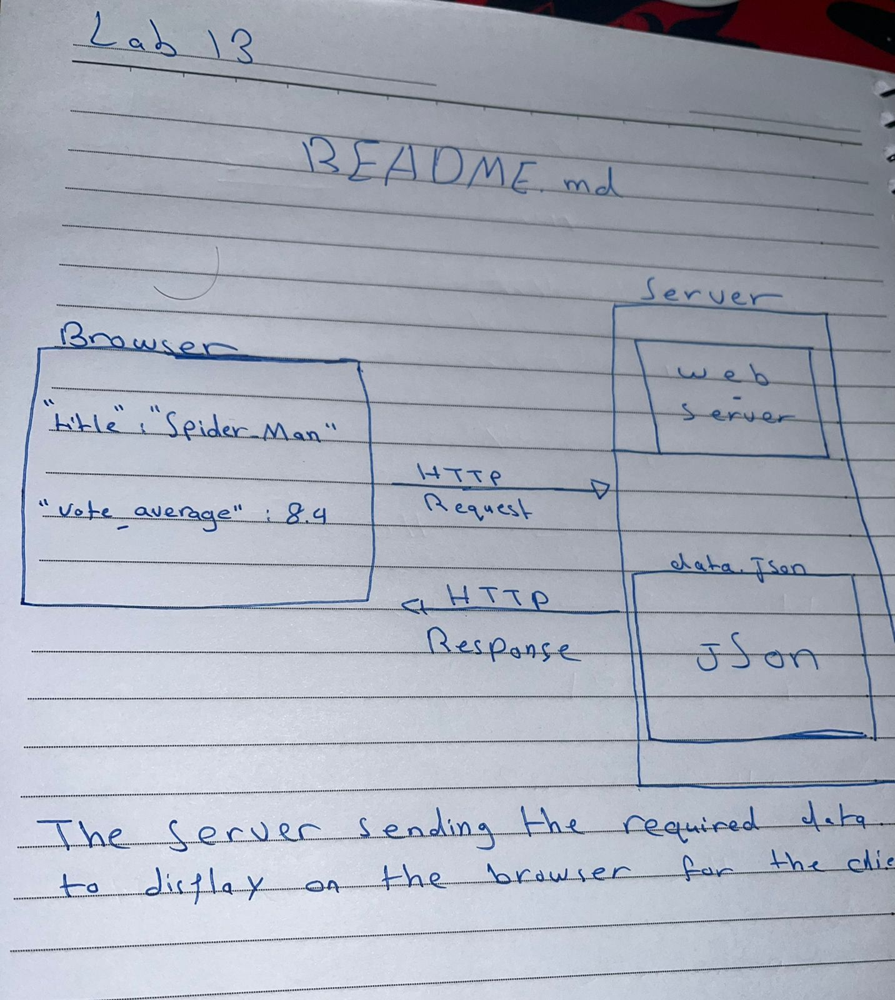

# Movies-Library

Project Name - Project Version

**Author Name**: Bashar Alirani

## WRRC

Add an image of your WRRC here

## Overview

## Getting Started

First the user have to create the basic files
then he has to install the required packages
after that he has to open the code and follow the requirements
\*to make sure that he wrote the code correctly install "Thunder Client" extension it's easier to use .

## Project Features

My app have the basic features asked in the lab reqirements
I'm working on port number "3003"
it can handle (404) error if you navigated to unexited page.
also the (500) error if something has gone wrong on the server while processing respone or a request from a client.
